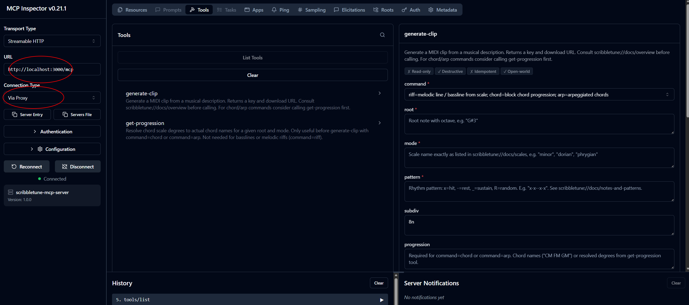

# scribbletune-mcp-server

> **Work in progress.** The server is functional but actively evolving. Feedback, ideas, bug reports, and contributions are warmly welcome — please open an issue or a PR.

An [MCP (Model Context Protocol)](https://modelcontextprotocol.io/) server that brings MIDI generation into AI agent workflows. It wraps [Scribbletune](https://scribbletune.com/) — a wonderful open-source library by [Walmik Deshpande](https://github.com/walmik) — and exposes it as a set of tools and resources that an LLM can call to compose and export MIDI clips.

---

## The idea

Modern AI assistants can talk about music — genres, moods, harmony, rhythm — but they can't *produce* it in a form you can load into your DAW. This project bridges that gap.

The intended workflow is an **AI agent acting as a creative co-producer**:

1. You describe a musical idea in natural language —  
   *"2-bar Deep Tech bassline in G# minor, 131 BPM, plucky, 16th-note groove"*
2. The agent reads the Scribbletune concept docs exposed as MCP resources to understand scales, patterns, and articulation parameters
3. It translates your idea into a structured tool call, discussing options with you if needed
4. The server generates a MIDI file and stores it in a key-value store
5. The agent hands you a download link — drag the `.mid` file straight into Ableton, Logic, FL Studio, or any DAW

No coding required on your end. The agent handles the translation from musical intent to MIDI.

---

## Features

- **Streamable HTTP transport** — stateless MCP over HTTP, compatible with any MCP client (Claude Desktop, custom agents, etc.)
- **`generate-clip` tool** — generate a MIDI clip from a musical description (riff, chord progression, or arpeggio)
- **`get-progression` tool** — resolve scale degrees to chord names before generating a clip
- **7 MCP resources** — Scribbletune concept documentation as Markdown so the agent understands notes, patterns, scales, chords, progressions, and genre-specific guidance out of the box
- **MIDI store service** — dedicated NestJS service backed by [Valkey](https://valkey.io/) for storing and serving MIDI files with Swagger UI
- Built with [NestJS](https://nestjs.com/), [@rekog/mcp-nest](https://github.com/rekog-labs/MCP-Nest), and [Nx](https://nx.dev/)

---

## Architecture

```
Your AI Agent (Claude, GPT, etc.)
        │
        │  MCP  (Streamable HTTP, stateless)
        ▼
scribbletune-mcp-server   :3000
        │
        │  POST /clips
        ▼
scribbletune-midi-store   :3001
        │
        ▼
   Redis / Valkey

        ↓
User downloads .mid → imports into DAW
```

---

## Getting started

### Prerequisites

- Node.js 20+
- npm

### Install

```bash
git clone https://github.com/claboran/scribbletune-mcp-ws.git
cd scribbletune-mcp-ws
npm install
```

### Start the full local stack

```bash
npm run valkey:up   # start Valkey in Docker
npm run dev         # start both apps in parallel
```

- MCP server: `http://localhost:3000/mcp`
- MIDI store: `http://localhost:3001`
- MIDI store Swagger UI: `http://localhost:3001/api`

To run apps individually:

```bash
npm run mcp:dev     # MCP server only
npm run store:dev   # MIDI store only
```

### Inspect with MCP Inspector

With the dev server running, open a second terminal:

```bash
npm run mcp:inspect
```

This launches the [@modelcontextprotocol/inspector](https://github.com/modelcontextprotocol/inspector) UI in your browser. Follow these steps to connect:

1. Set **Transport Type** to `Streamable HTTP`
2. Set **URL** to `http://localhost:3000/mcp`
3. Click **Connect**
4. Use the **Resources** tab to read the Scribbletune concept docs
5. Use the **Tools** tab to call `generate-clip` or `get-progression` interactively



### Build

```bash
npm run mcp:build
```

---

## MCP tools

### `generate-clip`

Generates a MIDI clip and returns a download key and URL.

| Parameter | Type | Description |
|-----------|------|-------------|
| `command` | `riff` \| `chord` \| `arp` | Type of clip: melodic line, chord block, or arpeggio |
| `root` | string | Root note with octave, e.g. `"G#3"` |
| `mode` | string | Scale name, e.g. `"minor"`, `"dorian"`, `"phrygian"` |
| `pattern` | string | Rhythm pattern: `x`=hit `-`=rest `_`=sustain `R`=random |
| `subdiv` | string | Step duration: `"16n"` `"8n"` `"4n"` `"1m"` … |
| `progression` | string | Chord names or degrees — required for `chord` / `arp` |
| `bpm` | number | Tempo in BPM |
| `sizzle` | string | Velocity envelope: `sin` `cos` `rampUp` `rampDown` |
| `amp` | number | Max velocity 0–127 |
| `accent` | string | Accent pattern, e.g. `"x--x"` |
| `arpCount` | number | Notes per chord for `arp` command (default 4) |
| `arpOrder` | string | Arp note order, e.g. `"0123"` ascending, `"3210"` descending |

Returns `{ key, downloadUrl, ttlSeconds, meta }`.

### `get-progression`

Resolves scale degrees to chord names. Useful before `generate-clip` when working with `chord` or `arp` commands. Not needed for basslines or melodic riffs.

| Parameter | Type | Description |
|-----------|------|-------------|
| `root` | string | Root note with octave |
| `mode` | enum | Scale/mode name |
| `degrees` | string | Space-separated degrees, e.g. `"I IV V ii"` — random if omitted |
| `count` | number | Number of chords when generating randomly (2–8) |

Returns `{ degrees, chordNames, hint }`.

---

## MCP resources

The agent reads these before making tool calls to avoid hallucinating invalid parameter values.

| URI | Description |
|-----|-------------|
| `scribbletune://docs/overview` | What Scribbletune is, the clip model, riff/chord/arp commands |
| `scribbletune://docs/clip` | Full `clip()` parameter reference |
| `scribbletune://docs/notes-and-patterns` | Note naming, octaves, pattern syntax |
| `scribbletune://docs/scales` | All 80+ valid scale names |
| `scribbletune://docs/chords` | Chord types and notation |
| `scribbletune://docs/progression` | Progression API and scale degree tables by mode |
| `scribbletune://docs/genre-scale-guide` | Genre → scale, BPM, and pattern recommendations |

---

## MIDI store client — OpenAPI code generation

The `scribbletune-midi-store` exposes a full OpenAPI 3 spec via its Swagger UI (served at `/api`). The `scribbletune-mcp-server` consumes this spec through a **generated TypeScript client** rather than a hand-written HTTP wrapper.

### How it works

1. The MIDI store serves its spec as JSON and YAML:
   - `GET http://localhost:3001/api-json`
   - `GET http://localhost:3001/api-yaml`

2. The spec is committed to `apps/scribbletune-mcp-server/open-api/scribbletune-open-api.yml`

3. The [OpenAPI Generator](https://openapi-generator.tech/) CLI produces a `typescript-fetch` client into `apps/scribbletune-mcp-server/src/midi-store-client/`

4. The `MidiStoreClient` in the MCP server imports the generated `ClipsApi` class instead of making raw `axios` / `form-data` calls

### Prerequisites

- Java 11+ (required by openapi-generator)
- The generator JAR at `open-api-generator-cli/openapi-generator-cli.jar` — download from the [OpenAPI Generator releases](https://github.com/OpenAPITools/openapi-generator/releases):

```bash
mkdir -p open-api-generator-cli
curl -L https://repo1.maven.org/maven2/org/openapitools/openapi-generator-cli/7.19.0/openapi-generator-cli-7.19.0.jar \
     -o open-api-generator-cli/openapi-generator-cli.jar
```

### Regenerate the client

With the MIDI store running (`npm run store:dev`), export the current spec, then regenerate:

```bash
# 1. Export the live spec
curl http://localhost:3001/api-yaml -o apps/scribbletune-mcp-server/open-api/scribbletune-open-api.yml

# 2. Regenerate the TypeScript fetch client
npm run store:generate:client
```

The generated files land in `apps/scribbletune-mcp-server/src/midi-store-client/` and are committed alongside the spec. Re-run these two steps whenever the MIDI store API changes.

### Generated client location

```
apps/scribbletune-mcp-server/
├── open-api/
│   └── scribbletune-open-api.yml     # committed spec snapshot
└── src/
    └── midi-store-client/            # generated — do not edit by hand
        ├── apis/
        │   └── ClipsApi.ts
        ├── models/
        │   └── SaveClipResponseDto.ts
        └── ...
```

---

## Project structure

This is an [Nx](https://nx.dev/) monorepo.

```
apps/
  scribbletune-mcp-server/   # MCP server — tools, resources, Scribbletune integration
  scribbletune-midi-store/   # MIDI store REST service — Valkey-backed, Swagger UI at /api
docker-compose.yml           # Valkey 8 for local development
```

---

## Roadmap

- [x] `scribbletune-midi-store` — Valkey-backed MIDI storage with HTTP download endpoint and Swagger UI
- [x] Docker Compose setup for full local stack
- [x] Wire generated OpenAPI client into `scribbletune-mcp-server` (replace handcrafted `MidiStoreClient`)
- [ ] Multi-clip session tool — generate bass, chords, and melody in a single call
- [ ] Example agent system prompts and Claude Desktop configuration

---

## Credits and acknowledgements

This project would not exist without the work of others.

**[Scribbletune](https://scribbletune.com/)** by [Walmik Deshpande](https://github.com/walmik) is the MIDI generation engine at the heart of this server. Scribbletune is a beautifully designed library that makes programmatic music composition expressive and accessible. Please visit the project, star the repo, and consider contributing.

**[@rekog/mcp-nest](https://github.com/rekog-labs/MCP-Nest)** by the rekog-labs team provides first-class NestJS integration for the Model Context Protocol and made building this server a pleasure.

**[Model Context Protocol](https://modelcontextprotocol.io/)** by Anthropic is the open standard that makes tool-augmented AI agents possible.

---

## Contributing

This project is in active early development and there is plenty of room to grow — in tooling, musical concepts, documentation quality, and agent integration examples.

- Open an issue to suggest features, report bugs, or discuss the direction
- PRs are welcome — please open an issue first for larger changes so we can align before you invest time

---

## License

[MIT](./LICENSE) — © 2026 the scribbletune-mcp-server contributors
